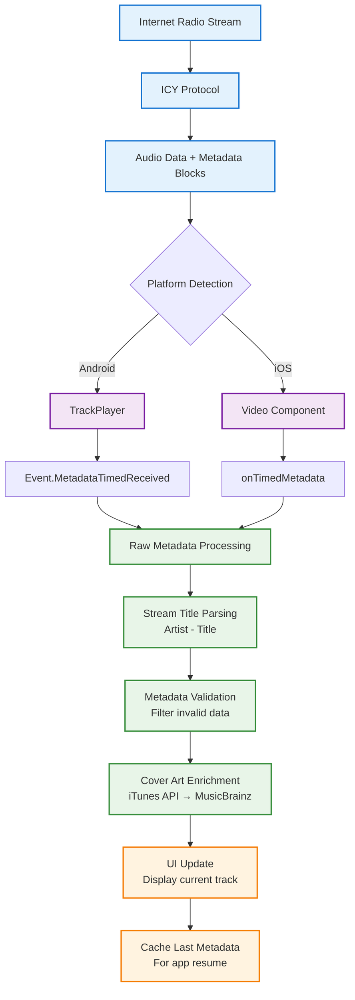
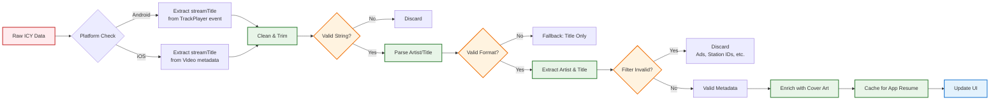
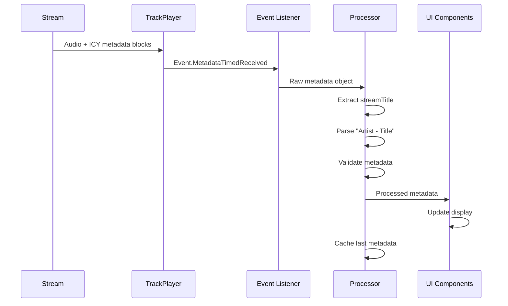
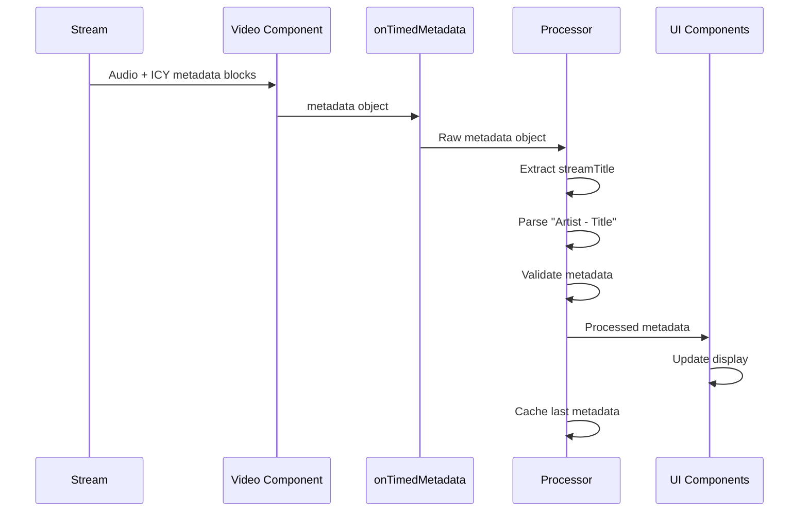
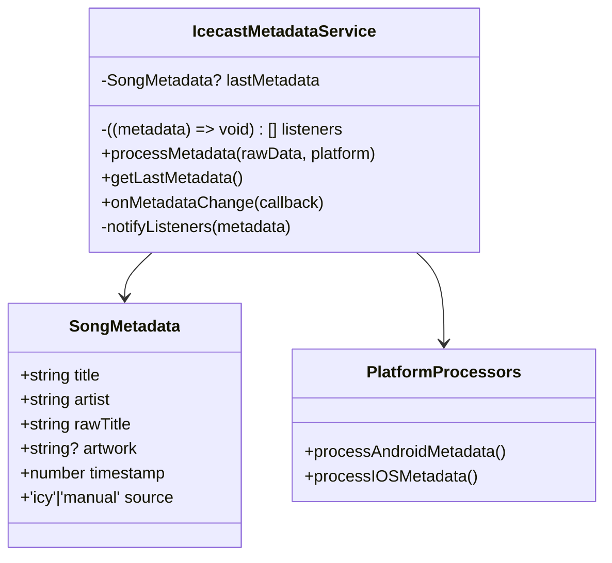
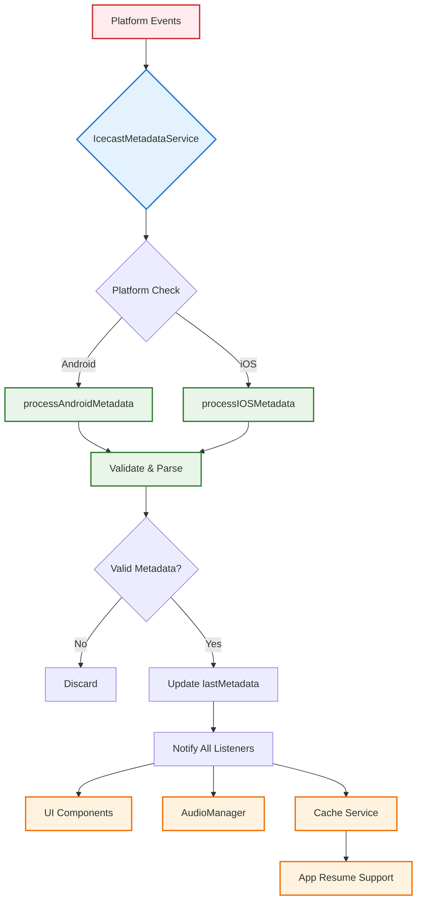
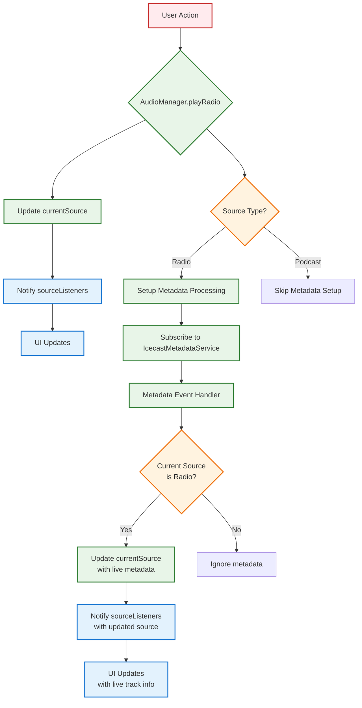
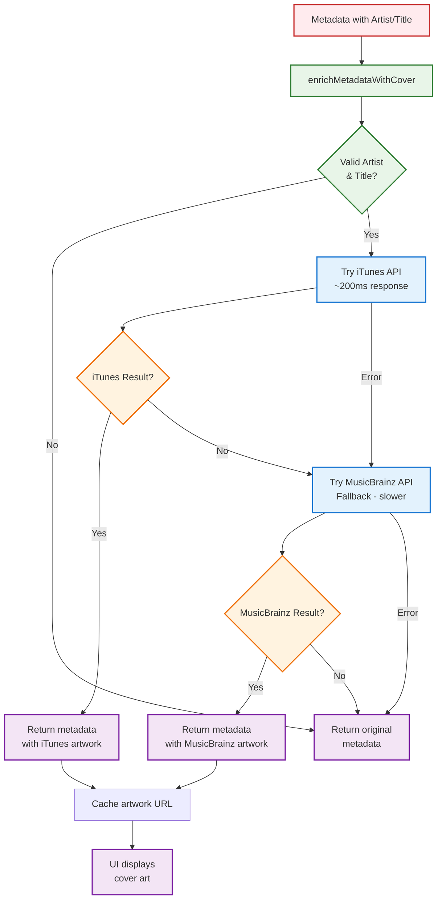

# ICY Stream Metadata Extraction

## Overview

ICY (I Can Yell) is a protocol used for streaming audio metadata alongside audio content, commonly used in internet radio streams. This document explains how to extract and process ICY metadata in the WeBe Radio app across different platforms.

## What is ICY Metadata?

ICY metadata provides real-time information about the currently playing audio track, including:

- **StreamTitle**: The title of the current song/track
- **StreamUrl**: URL associated with the current track (optional)
- Additional metadata fields depending on the stream

### ICY Protocol Basics

- **ICY headers**: Sent at the beginning of the stream connection
- **Metadata blocks**: Interspersed within the audio stream
- **Metadata interval**: Defines how often metadata is sent (typically every 8192 bytes)
- **Metadata format**: Null-terminated string with key-value pairs

## ICY Metadata Flow



### Metadata Processing Pipeline



## Platform-Specific Implementation

### Android Implementation Flow



### iOS Implementation Flow



### Android (react-native-track-player)

#### Event-Based Metadata Extraction

```typescript
import TrackPlayer, { Event } from 'react-native-track-player';

// Setup event listener for metadata
TrackPlayer.addEventListener(Event.MetadataTimedReceived, async (data) => {
  console.log('Raw ICY metadata received:', data);

  // Process the metadata
  const metadata = processIcyMetadata(data);
  if (metadata) {
    // Update UI with new metadata
    updateSongDisplay(metadata);
  }
});

// Process raw ICY metadata
function processIcyMetadata(rawData: any): SongMetadata | null {
  try {
    // Extract metadata from TrackPlayer event
    const streamTitle = rawData.streamTitle || rawData.title;

    if (!streamTitle) return null;

    // Parse the stream title (usually "Artist - Title" format)
    const parsed = parseStreamTitle(streamTitle);

    return {
      title: parsed.title,
      artist: parsed.artist,
      rawTitle: streamTitle,
      timestamp: Date.now()
    };
  } catch (error) {
    console.error('Error processing ICY metadata:', error);
    return null;
  }
}
```

#### TrackPlayer Setup for ICY

```typescript
import TrackPlayer from 'react-native-track-player';

// Initialize TrackPlayer with ICY support
await TrackPlayer.setupPlayer({
  // Enable metadata extraction
  autoUpdateMetadata: true,
  // Wait for capabilities to be ready
  waitForBuffer: true,
});

// Add radio stream with ICY metadata support
await TrackPlayer.add({
  id: 'webe-radio',
  url: 'https://stream.webe.radio/live',
  title: 'WeBe Radio',
  artist: 'WeBe Radio',
  type: TrackPlayer.TrackType.HLS, // or DASH depending on stream
});
```

### iOS (react-native-video)

#### Video Component Metadata Extraction

```typescript
import Video from 'react-native-video';

// In your component
<Video
  source={{ uri: streamUrl }}
  ref={videoRef}
  onTimedMetadata={(metadata) => {
    console.log('iOS ICY metadata received:', metadata);

    // Process iOS-specific metadata format
    const processedMetadata = processIOSMetadata(metadata);
    if (processedMetadata) {
      updateSongDisplay(processedMetadata);
    }
  }}
  // ... other props
/>
```

#### iOS Metadata Processing

```typescript
function processIOSMetadata(metadata: any): SongMetadata | null {
  try {
    // iOS provides metadata in different format than Android
    // Extract from the metadata object
    const streamTitle = metadata.streamTitle || metadata.title;

    if (!streamTitle) return null;

    // Parse the stream title
    const parsed = parseStreamTitle(streamTitle);

    return {
      title: parsed.title,
      artist: parsed.artist,
      rawTitle: streamTitle,
      timestamp: Date.now()
    };
  } catch (error) {
    console.error('Error processing iOS ICY metadata:', error);
    return null;
  }
}
```

## Metadata Processing Utilities

### Stream Title Parsing

```typescript
interface ParsedTitle {
  artist: string;
  title: string;
  isValid: boolean;
}

function parseStreamTitle(streamTitle: string): ParsedTitle {
  // Remove extra whitespace and clean the string
  const cleanTitle = streamTitle.trim();

  // Common separators in ICY metadata
  const separators = [' - ', ' – ', ' — ', ' | ', ' / '];

  for (const separator of separators) {
    if (cleanTitle.includes(separator)) {
      const parts = cleanTitle.split(separator);
      if (parts.length >= 2) {
        return {
          artist: parts[0].trim(),
          title: parts.slice(1).join(separator).trim(),
          isValid: true
        };
      }
    }
  }

  // Fallback: treat entire string as title
  return {
    artist: '',
    title: cleanTitle,
    isValid: false
  };
}
```

### Metadata Validation and Filtering

```typescript
function isValidMetadata(metadata: SongMetadata): boolean {
  // Check for empty or invalid data
  if (!metadata.title || metadata.title.trim().length === 0) {
    return false;
  }

  // Filter out common invalid metadata
  const invalidTitles = [
    'unknown',
    'advertisement',
    'commercial break',
    'station id',
    'news bulletin'
  ];

  const titleLower = metadata.title.toLowerCase();
  return !invalidTitles.some(invalid => titleLower.includes(invalid));
}
```

## Cross-Platform Metadata Service

### Unified Metadata Interface



### Service Architecture Flow



```typescript
interface SongMetadata {
  title: string;
  artist: string;
  rawTitle: string;
  artwork?: string;
  timestamp: number;
  source: 'icy' | 'manual';
}

class IcecastMetadataService {
  private lastMetadata: SongMetadata | null = null;
  private listeners: ((metadata: SongMetadata) => void)[] = [];

  // Process metadata from any platform
  processMetadata(rawData: any, platform: 'android' | 'ios'): void {
    const metadata = platform === 'android'
      ? processAndroidMetadata(rawData)
      : processIOSMetadata(rawData);

    if (metadata && isValidMetadata(metadata)) {
      this.lastMetadata = metadata;
      this.notifyListeners(metadata);
    }
  }

  // Get last known metadata (useful for app resume)
  getLastMetadata(): SongMetadata | null {
    return this.lastMetadata;
  }

  // Subscribe to metadata changes
  onMetadataChange(callback: (metadata: SongMetadata) => void): () => void {
    this.listeners.push(callback);

    // Return unsubscribe function
    return () => {
      const index = this.listeners.indexOf(callback);
      if (index > -1) {
        this.listeners.splice(index, 1);
      }
    };
  }

  private notifyListeners(metadata: SongMetadata): void {
    this.listeners.forEach(callback => {
      try {
        callback(metadata);
      } catch (error) {
        console.error('Error in metadata listener:', error);
      }
    });
  }
}
```

## Integration with AudioManager

### Metadata-Aware Audio Source Management



```typescript
// In AudioManager.ts
private currentSource: AudioSource | null = null;
private metadataService = new IcecastMetadataService();

// Handle source changes with metadata filtering
async playRadio(source: AudioSource): Promise<void> {
  // ... existing playback logic ...

  // Update current source
  this.currentSource = source;

  // Notify listeners about source change
  this.notifySourceChange(source);

  // Setup metadata processing based on source type
  if (source.type === 'radio') {
    this.setupMetadataProcessing();
  }
}

private setupMetadataProcessing(): void {
  // Subscribe to metadata changes
  this.metadataService.onMetadataChange((metadata) => {
    // Only process metadata if we're playing radio
    if (this.currentSource?.type === 'radio') {
      // Update the current source with live metadata
      const updatedSource = {
        ...this.currentSource,
        title: metadata.title,
        artist: metadata.artist,
        metadata: metadata
      };

      this.currentSource = updatedSource;
      this.notifySourceChange(updatedSource);
    }
  });
}
```

## Cover Art Enrichment

### Automatic Cover Art Fetching



```typescript
async function enrichMetadataWithCover(metadata: SongMetadata): Promise<SongMetadata> {
  try {
    // Try iTunes API first (fast response)
    const iTunesResult = await searchITunesCover(metadata.artist, metadata.title);
    if (iTunesResult) {
      return { ...metadata, artwork: iTunesResult };
    }

    // Fallback to MusicBrainz
    const musicBrainzResult = await searchMusicBrainzCover(metadata.artist, metadata.title);
    if (musicBrainzResult) {
      return { ...metadata, artwork: musicBrainzResult };
    }

    // Return original metadata if no cover found
    return metadata;
  } catch (error) {
    console.error('Error fetching cover art:', error);
    return metadata;
  }
}

// iTunes Search API (fast, ~200ms response)
async function searchITunesCover(artist: string, title: string): Promise<string | null> {
  const query = encodeURIComponent(`${artist} ${title}`);
  const response = await fetch(
    `https://itunes.apple.com/search?term=${query}&limit=1&media=music`
  );

  const data = await response.json();
  return data.results?.[0]?.artworkUrl100?.replace('100x100', '600x600') || null;
}

// MusicBrainz Cover Art Archive (fallback)
async function searchMusicBrainzCover(artist: string, title: string): Promise<string | null> {
  // Implementation for MusicBrainz API
  // This is more complex and slower, used as fallback
  // ... implementation details ...
}
```

## Error Handling and Debugging

### Common ICY Issues

```typescript
// Debug metadata events
TrackPlayer.addEventListener(Event.MetadataTimedReceived, (data) => {
  console.log('=== ICY Metadata Debug ===');
  console.log('Raw data:', JSON.stringify(data, null, 2));
  console.log('Stream title:', data.streamTitle);
  console.log('All keys:', Object.keys(data));
  console.log('========================');
});

// Handle metadata parsing errors
function safeParseMetadata(rawData: any): SongMetadata | null {
  try {
    // Validate input
    if (!rawData || typeof rawData !== 'object') {
      console.warn('Invalid metadata format:', rawData);
      return null;
    }

    // Extract and validate stream title
    const streamTitle = rawData.streamTitle || rawData.title;
    if (!streamTitle || typeof streamTitle !== 'string') {
      console.warn('No valid stream title found');
      return null;
    }

    // Parse and return metadata
    const parsed = parseStreamTitle(streamTitle.trim());
    return {
      title: parsed.title,
      artist: parsed.artist,
      rawTitle: streamTitle,
      timestamp: Date.now(),
      source: 'icy'
    };
  } catch (error) {
    console.error('Metadata parsing error:', error);
    return null;
  }
}
```

### Testing ICY Streams

```typescript
// Test script for ICY metadata extraction
async function testIcyStream(url: string): Promise<void> {
  console.log(`Testing ICY stream: ${url}`);

  try {
    // For Android testing
    await TrackPlayer.reset();
    await TrackPlayer.add({
      id: 'test-stream',
      url: url,
      title: 'Test Stream'
    });
    await TrackPlayer.play();

    // Listen for metadata events
    const unsubscribe = TrackPlayer.addEventListener(
      Event.MetadataTimedReceived,
      (data) => {
        console.log('✅ ICY metadata received:', data);
        unsubscribe(); // Remove listener after first metadata
      }
    );

    // Timeout after 10 seconds
    setTimeout(() => {
      console.log('❌ No metadata received within 10 seconds');
      unsubscribe();
    }, 10000);

  } catch (error) {
    console.error('❌ Test failed:', error);
  }
}
```

## Best Practices

### Performance Optimization

1. **Debounce metadata updates**: Don't update UI on every metadata event
2. **Cache cover art**: Store fetched artwork to avoid repeated API calls
3. **Validate before processing**: Filter out invalid or duplicate metadata
4. **Memory management**: Clean up event listeners when components unmount

### Reliability

1. **Fallback handling**: Gracefully handle missing or malformed metadata
2. **Platform differences**: Account for Android/iOS metadata format differences
3. **Network resilience**: Handle stream interruptions and reconnections
4. **Error recovery**: Implement retry logic for failed cover art fetches

### User Experience

1. **Loading states**: Show loading indicators during metadata processing
2. **Graceful degradation**: Display fallback information when metadata unavailable
3. **Smooth transitions**: Animate metadata changes for better UX
4. **Offline support**: Cache last known metadata for offline scenarios

## Troubleshooting

### Common Issues

**No metadata received:**

- Check if stream supports ICY metadata
- Verify correct event listener setup
- Test with different ICY streams

**Malformed metadata:**

- Implement robust parsing with error handling
- Log raw metadata for debugging
- Handle edge cases in title parsing

**Platform differences:**

- Android: `Event.MetadataTimedReceived`
- iOS: `onTimedMetadata` callback
- Test on both platforms during development

**Performance issues:**

- Debounce rapid metadata updates
- Cache expensive operations (cover art fetching)
- Use efficient string parsing methods

---

*This document covers ICY metadata extraction as implemented in WeBe Radio v5.2.1. The implementation handles cross-platform differences between Android (TrackPlayer) and iOS (Video components) while providing a unified metadata interface.*
</content>
