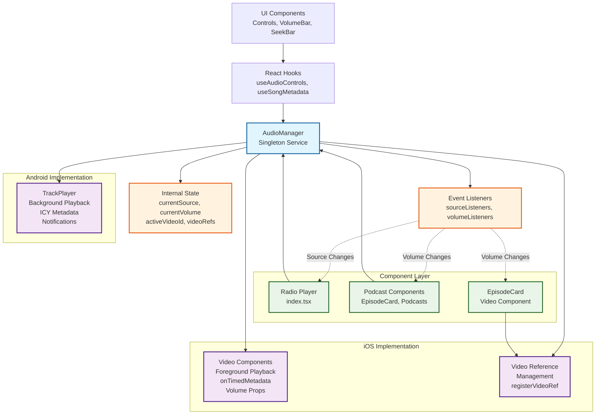
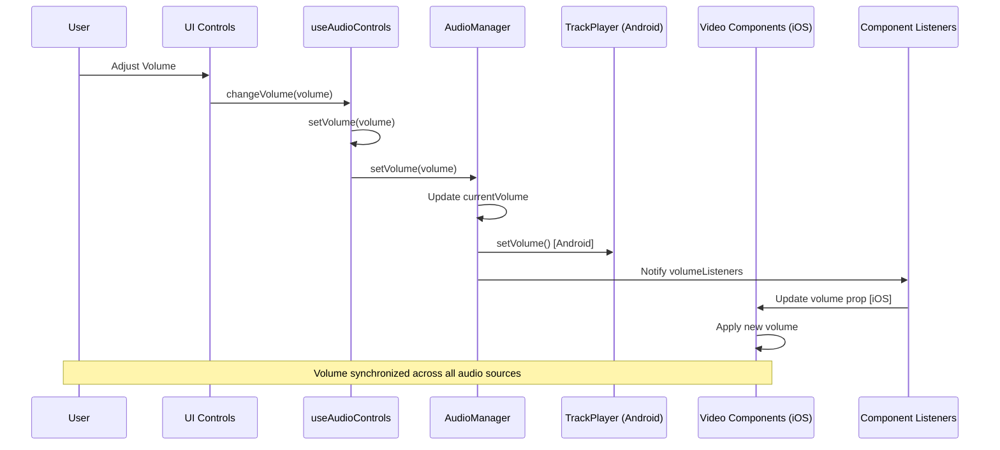
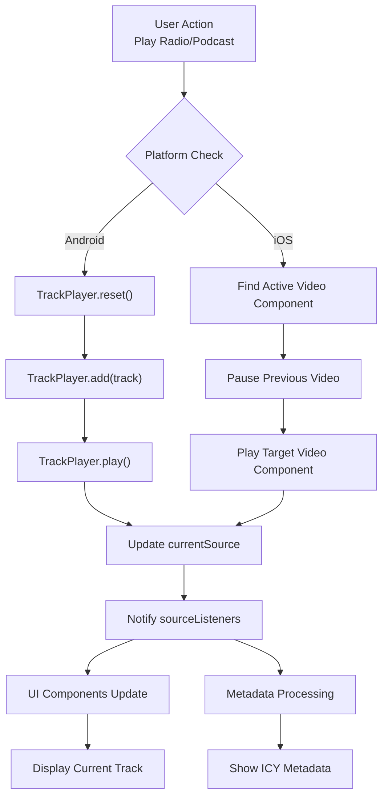

# AudioManager Architecture

## Overview

The `AudioManager` is a centralized service that provides unified audio playback management across the WeBe Radio app. It abstracts platform-specific audio implementations (Android's `react-native-track-player` vs iOS's `react-native-video`) into a single, consistent API.

## Core Responsibilities

- **Cross-platform audio playback**: Unified interface for Android (TrackPlayer) and iOS (Video components)
- **Source management**: Handles different audio types (radio streams, podcasts, episodes)
- **Volume coordination**: Centralized volume control across all audio sources
- **State synchronization**: Maintains current playback state and notifies listeners
- **Resource management**: Manages Video component references for iOS playback

## Architecture

### Design Patterns

- **Singleton Pattern**: Single `audioManager` instance exported for app-wide use
- **Observer Pattern**: Event-driven notifications for source and volume changes
- **Adapter Pattern**: Platform-specific implementations behind unified interface
- **Factory Pattern**: `audioSourceToTrack()` converts AudioSource to TrackPlayer Track

### Architecture Diagram



### Volume Coordination Flow



### Source Management Flow



### Key Components

```typescript
interface AudioSource {
  id: string;           // Unique identifier
  url: string;          // Audio stream/podcast URL
  title: string;        // Display title
  artist: string;       // Display artist
  artwork?: string;     // Cover art URL
  type: 'radio' | 'podcast' | 'episode';  // Audio source type
  metadata?: any;       // Additional metadata
  isLiveStream?: boolean; // Live vs on-demand
}
```

## State Management

### Internal State

```typescript
private currentSource: AudioSource | null = null;     // Currently playing source
private currentVolume: number = 0.5;                 // Global volume level (0-1)
private activeVideoId: string | null = null;         // Active iOS Video component
private videoRefs: Map<string, VideoRef | null>;     // iOS Video component registry
```

### Event Listeners

```typescript
private listeners: ((source: AudioSource | null) => void)[];      // Source change listeners
private volumeListeners: ((volume: number) => void)[];           // Volume change listeners
```

## Core Functionality

### Playback Control

#### Radio Stream Playback

```typescript
async playRadio(source: AudioSource)
```

- **Android**: Uses TrackPlayer with `reset()` → `add()` → `play()`
- **iOS**: Delegates to `playVideoOnIOS()` for Video component playback
- Updates `currentSource` and notifies listeners

#### Podcast/Episode Playback

```typescript
async playPodcast(source: AudioSource)
```

- Same implementation as radio playback
- Handles both podcast episodes and regular podcast streams
- Type differentiation via `source.type`

#### Playback State Control

```typescript
async stop()                    // Stop all playback
async isPlaying(): Promise<boolean>  // Check playback state
```

### Volume Management

#### Centralized Volume Control

```typescript
async setVolume(volume: number)  // Set global volume (0-1)
getVolume(): number             // Get current volume
```

**Volume Coordination Flow:**

1. User adjusts volume via UI controls
2. `useAudioControls` calls `audioManager.setVolume()`
3. AudioManager updates `currentVolume`
4. **Android**: Calls `TrackPlayer.setVolume()`
5. **iOS**: Notifies volume listeners (Video components update via props)
6. All UI components reflect new volume

#### Volume Listeners

```typescript
onVolumeChange(callback: (volume: number) => void)
```

- Observer pattern for volume synchronization
- Video components subscribe to volume changes
- Prevents memory leaks with proper cleanup

### Seeking and Position Control

#### iOS Video Seeking

```typescript
seekVideoOnIOS(time: number)
```

- Seeks active Video component to specified time
- Only works on iOS (Android uses TrackPlayer.seekTo())

### Cross-Platform Abstraction

#### Platform-Specific Implementations

**Android (TrackPlayer):**

- Background playback support
- Notification controls
- ICY metadata extraction
- Hardware volume buttons

**iOS (Video Components):**

- Foreground playback via Video components
- ICY metadata via `onTimedMetadata`
- Volume via component props
- Seeking via Video ref methods

#### Platform Detection

```typescript
if (Platform.OS === 'android') {
  // TrackPlayer implementation
} else {
  // Video component implementation
}
```

## Video Component Management (iOS)

### Reference Registration

```typescript
registerVideoRef(id: string, ref: VideoRef | null)
unregisterVideoRef(id: string)
```

**Purpose**: Maintains mapping between audio sources and Video components for iOS playback.

**Usage Pattern:**

```typescript
// In Video component
useEffect(() => {
  audioManager.registerVideoRef(sourceId, videoRef.current);
  return () => audioManager.unregisterVideoRef(sourceId);
}, [sourceId]);
```

### Playback Coordination

- **Single Active Video**: Only one Video component plays at a time
- **Automatic Pause**: Switching sources pauses previous Video
- **Reference Cleanup**: Prevents memory leaks when components unmount

## Event System

### Source Change Notifications

```typescript
onSourceChange(callback: (source: AudioSource | null) => void)
```

- Notifies when playback source changes
- Used by UI components to update display
- Immediate callback with current state on subscription

### Volume Change Notifications

```typescript
onVolumeChange(callback: (volume: number) => void)
```

- Notifies when global volume changes
- Used by Video components to update volume props
- Immediate callback with current volume on subscription

### Listener Management

- **Memory Safe**: Proper cleanup prevents memory leaks
- **Immediate Sync**: New listeners get current state immediately
- **Unsubscribe Pattern**: Returns cleanup function

## Integration Points

### useAudioControls Hook

```typescript
// Volume coordination
function changeVolume(volume: number) {
  setVolume(volume);
  audioManager.setVolume(volume);  // Centralized volume
}
```

### useSongMetadata Hook

```typescript
// Source awareness for metadata filtering
const currentSource = audioManager.getCurrentSource();
if (currentSource?.type === 'radio') {
  // Process ICY metadata
}
```

### Component Integration

#### Main Radio Player (index.tsx)

```typescript
// Listen to source changes
useEffect(() => {
  const unsubscribe = audioManager.onSourceChange((source) => {
    setCurrentSource(source);
  });
  return unsubscribe;
}, []);

// Listen to volume changes
useEffect(() => {
  const unsubscribe = audioManager.onVolumeChange((volume) => {
    // Update Video component volume prop
  });
  return unsubscribe;
}, []);
```

#### Podcast Components (EpisodeCard, Podcasts)

```typescript
// Register Video refs for iOS
useEffect(() => {
  audioManager.registerVideoRef(episodeId, videoRef.current);
  return () => audioManager.unregisterVideoRef(episodeId);
}, [episodeId]);

// Listen to volume changes
useEffect(() => {
  const unsubscribe = audioManager.onVolumeChange((volume) => {
    setVolume(volume);  // Update local state for Video prop
  });
  return unsubscribe;
}, []);
```

## Error Handling

### TrackPlayer Errors

```typescript
try {
  await TrackPlayer.setVolume(volume);
} catch (error) {
  console.log('Error setting TrackPlayer volume:', error);
}
```

### Video Component Errors

- Handled at component level via `onError` callbacks
- AudioManager focuses on coordination, not error recovery

## Performance Considerations

### Memory Management

- **Reference Cleanup**: Proper unregistration prevents leaks
- **Listener Cleanup**: Unsubscribe functions prevent accumulation
- **Single Active Source**: Only one audio source active at a time

### Event Efficiency

- **Immediate Sync**: New listeners get current state without delay
- **Batch Updates**: Single notification for multiple listeners
- **Platform Optimization**: Minimal cross-platform overhead

## Usage Examples

### Basic Playback

```typescript
// Play radio stream
await audioManager.playRadio({
  id: 'webe-radio',
  url: 'https://stream.webe.radio/live',
  title: 'WeBe Radio',
  artist: 'WeBe Radio',
  type: 'radio',
  isLiveStream: true
});

// Play podcast episode
await audioManager.playPodcast({
  id: 'episode-123',
  url: 'https://example.com/episode.mp3',
  title: 'Episode Title',
  artist: 'Podcast Name',
  type: 'episode'
});
```

### Volume Control

```typescript
// Set volume (affects all active audio)
await audioManager.setVolume(0.7);

// Listen to volume changes
const unsubscribe = audioManager.onVolumeChange((volume) => {
  console.log('Volume changed to:', volume);
  // Update UI/Video components
});
```

#### Example Component Integration

```typescript
function MyAudioComponent() {
  const [currentSource, setCurrentSource] = useState(null);
  const [volume, setVolume] = useState(0.5);

  useEffect(() => {
    // Listen to source changes
    const sourceUnsub = audioManager.onSourceChange(setCurrentSource);

    // Listen to volume changes
    const volumeUnsub = audioManager.onVolumeChange(setVolume);

    return () => {
      sourceUnsub();
      volumeUnsub();
    };
  }, []);

  return (
    <Video
      volume={volume}
      paused={currentSource?.id !== mySourceId}
      // ... other props
    />
  );
}
```

## Future Enhancements

### Potential Improvements

- **Queue Management**: Support for playback queues
- **Gapless Playback**: Seamless transitions between tracks
- **Offline Support**: Download and cache audio content
- **Advanced Seeking**: Chapter markers and bookmarks
- **Audio Effects**: Equalizer and audio processing
- **Multi-Room**: Synchronized playback across devices

### Architecture Extensions

- **Plugin System**: Extensible audio processing pipeline
- **State Persistence**: Save/restore playback state across app restarts
- **Network Optimization**: Adaptive bitrate streaming
- **Analytics Integration**: Playback metrics and user behavior tracking

---

*This document describes the AudioManager architecture as of v5.2.1. The design prioritizes cross-platform compatibility, centralized state management, and clean separation of concerns.*
