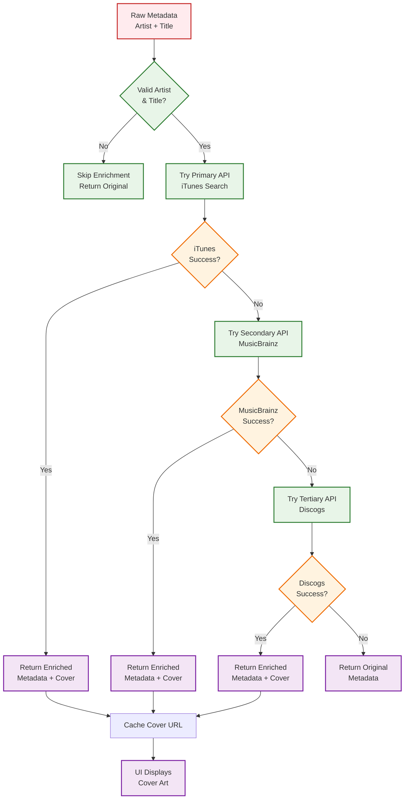
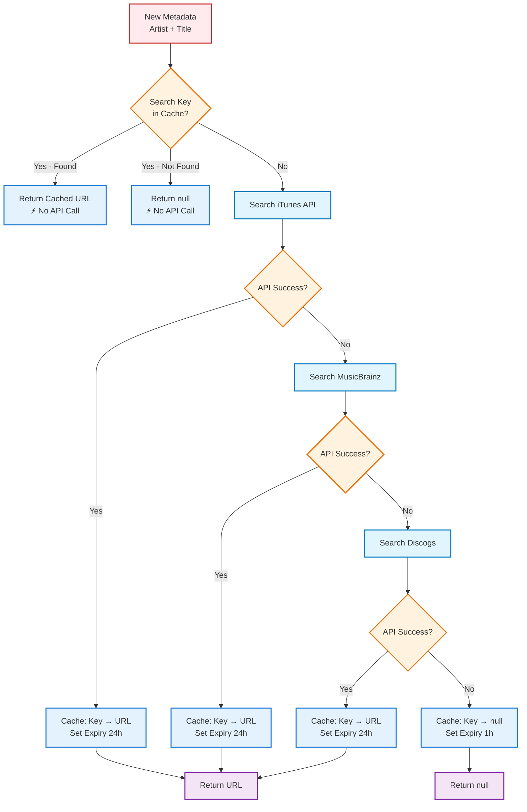
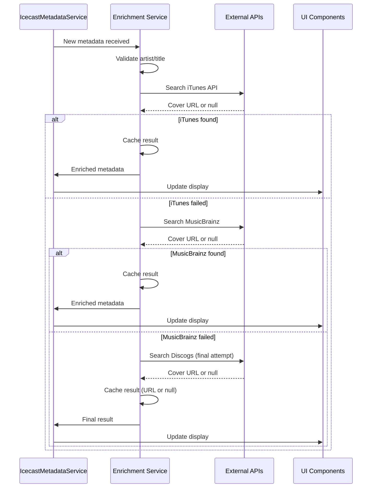

# Metadata Cover Art Enrichment

## Overview

Metadata cover art enrichment is the process of automatically fetching album artwork for songs based on their artist and title information. This enhances the user experience by displaying visually appealing cover art alongside track information.

The WeBe Radio app implements a multi-tier enrichment strategy that ensures high success rates while maintaining performance and reliability.

## Enrichment Strategy

### Multi-Tier API Approach



### API Selection Rationale

1. **iTunes Search API (Primary)**
   - **Response Time**: ~200ms (fastest)
   - **Success Rate**: High for popular music
   - **Image Quality**: Multiple sizes available (100x100 to 600x600)
   - **Rate Limits**: Generous for most use cases
   - **Authentication**: None required

2. **MusicBrainz Cover Art Archive (Secondary)**
   - **Response Time**: ~500-1000ms (slower)
   - **Success Rate**: Good for niche/indie music
   - **Image Quality**: High resolution covers
   - **Rate Limits**: More restrictive
   - **Authentication**: None required

3. **Discogs (Tertiary/Final Fallback)**
   - **Response Time**: ~800-1200ms (slowest)
   - **Success Rate**: Excellent for vinyl/physical releases, rare editions
   - **Image Quality**: Variable (often high quality)
   - **Rate Limits**: Requires authentication, limited requests
   - **Authentication**: API key + secret required
   - **Special Handling**: Filters out unofficial releases and placeholder images

## Implementation Details

### Core Enrichment Function

```typescript
interface EnrichedMetadata {
  title: string;
  artist: string;
  rawTitle: string;
  artwork?: string;
  timestamp: number;
  source: 'icy' | 'manual';
  enrichmentStatus: 'success' | 'failed' | 'skipped';
}

/**
 * Enrich metadata with cover art using multiple API fallbacks
 */
async function enrichMetadataWithCover(
  metadata: SongMetadata
): Promise<EnrichedMetadata> {
  // Validate input
  if (!metadata.artist?.trim() || !metadata.title?.trim()) {
    return {
      ...metadata,
      enrichmentStatus: 'skipped'
    };
  }

  try {
    // Try iTunes API first (fast, high success rate)
    const iTunesResult = await searchITunesCover(metadata.artist, metadata.title);
    if (iTunesResult) {
      return {
        ...metadata,
        artwork: iTunesResult,
        enrichmentStatus: 'success'
      };
    }

    // Fallback to MusicBrainz (slower, but covers more music)
    const musicBrainzResult = await searchMusicBrainzCover(metadata.artist, metadata.title);
    if (musicBrainzResult) {
      return {
        ...metadata,
        artwork: musicBrainzResult,
        enrichmentStatus: 'success'
      };
    }

    // Final fallback to Discogs (slowest, but excellent for rare/vinyl releases)
    const discogsResult = await searchDiscogsCover(metadata.artist, metadata.title);
    if (discogsResult) {
      return {
        ...metadata,
        artwork: discogsResult,
        enrichmentStatus: 'success'
      };
    }

    // No cover found
    return {
      ...metadata,
      enrichmentStatus: 'failed'
    };
  } catch (error) {
    console.error('Cover art enrichment error:', error);
    return {
      ...metadata,
      enrichmentStatus: 'failed'
    };
  }
}
```

### iTunes Search API Integration

#### API Overview

The iTunes Search API provides access to Apple's music catalog with high-quality cover art.

**Endpoint**: `https://itunes.apple.com/search`
**Method**: GET
**Rate Limit**: Generous (no strict limits for normal usage)

#### Implementation

```typescript
interface ITunesSearchResult {
  resultCount: number;
  results: Array<{
    artistName: string;
    trackName: string;
    artworkUrl100: string;
    artworkUrl600?: string;
    collectionName?: string;
  }>;
}

/**
 * Search iTunes for cover art
 * @param artist - Artist name
 * @param title - Song title
 * @returns Promise<string | null> - Cover URL or null if not found
 */
async function searchITunesCover(artist: string, title: string): Promise<string | null> {
  try {
    // Create search query
    const query = encodeURIComponent(`${artist} ${title}`);
    const url = `https://itunes.apple.com/search?term=${query}&limit=1&media=music`;

    // Make request with timeout
    const controller = new AbortController();
    const timeoutId = setTimeout(() => controller.abort(), 5000); // 5s timeout

    const response = await fetch(url, {
      signal: controller.signal,
      headers: {
        'User-Agent': 'WeBeRadioApp/1.0'
      }
    });

    clearTimeout(timeoutId);

    if (!response.ok) {
      throw new Error(`iTunes API error: ${response.status}`);
    }

    const data: ITunesSearchResult = await response.json();

    // Check if we got results
    if (data.resultCount === 0 || !data.results[0]) {
      return null;
    }

    const result = data.results[0];

    // Validate result matches our search
    const artistMatch = result.artistName.toLowerCase().includes(artist.toLowerCase());
    const titleMatch = result.trackName.toLowerCase().includes(title.toLowerCase());

    if (!artistMatch && !titleMatch) {
      return null; // Result doesn't match our search
    }

    // Return highest quality artwork available
    return result.artworkUrl600 ||
           result.artworkUrl100.replace('100x100', '600x600') ||
           result.artworkUrl100;

  } catch (error) {
    if (error.name === 'AbortError') {
      console.warn('iTunes API request timeout');
    } else {
      console.error('iTunes API error:', error);
    }
    return null;
  }
}
```

#### Query Optimization

```typescript
/**
 * Optimize search query for better results
 */
function optimizeSearchQuery(artist: string, title: string): string {
  // Remove common suffixes that might interfere with search
  const cleanArtist = artist
    .replace(/\s*\([^)]*\)/g, '') // Remove parentheses
    .replace(/\s*\[[^\]]*\]/g, '') // Remove brackets
    .replace(/\s*feat\.?\s*.*$/i, '') // Remove featuring artists
    .trim();

  const cleanTitle = title
    .replace(/\s*\([^)]*\)/g, '') // Remove parentheses
    .replace(/\s*\[[^\]]*\]/g, '') // Remove brackets
    .replace(/\s*-\s*.*remix.*$/i, '') // Remove remix info
    .trim();

  return `${cleanArtist} ${cleanTitle}`;
}
```

### MusicBrainz Cover Art Archive Integration

#### API Overview

MusicBrainz provides comprehensive music metadata including cover art through their Cover Art Archive.

**Process**: Artist/Title → MusicBrainz Search → Release MBID → Cover Art Archive
**Rate Limit**: 1 request/second per IP
**Response Time**: Slower than iTunes but more comprehensive

#### Implementation

```typescript
/**
 * Search MusicBrainz for cover art
 * This is more complex as it requires multiple API calls
 */
async function searchMusicBrainzCover(artist: string, title: string): Promise<string | null> {
  try {
    // Step 1: Search for releases
    const releaseId = await searchMusicBrainzRelease(artist, title);
    if (!releaseId) return null;

    // Step 2: Get cover art for the release
    const coverUrl = await getMusicBrainzCoverArt(releaseId);
    return coverUrl;

  } catch (error) {
    console.error('MusicBrainz search error:', error);
    return null;
  }
}

/**
 * Search MusicBrainz for a release matching artist and title
 */
async function searchMusicBrainzRelease(artist: string, title: string): Promise<string | null> {
  const query = encodeURIComponent(`artist:"${artist}" AND recording:"${title}"`);
  const url = `https://musicbrainz.org/ws/2/release?query=${query}&limit=1&fmt=json`;

  try {
    const response = await fetch(url, {
      headers: {
        'User-Agent': 'WeBeRadioApp/1.0 (https://webe.radio)'
      }
    });

    if (!response.ok) return null;

    const data = await response.json();

    if (data.releases?.[0]?.id) {
      return data.releases[0].id;
    }

    return null;
  } catch (error) {
    console.error('MusicBrainz release search error:', error);
    return null;
  }
}

/**
 * Get cover art for a MusicBrainz release
 */
async function getMusicBrainzCoverArt(releaseId: string): Promise<string | null> {
  const url = `https://coverartarchive.org/release/${releaseId}`;

  try {
    const response = await fetch(url);

    if (!response.ok) return null;

    const data = await response.json();

    // Find front cover image
    const frontCover = data.images?.find((img: any) =>
      img.types?.includes('Front') && img.front
    );

    if (frontCover) {
      // Return largest available size
      return frontCover.thumbnails?.large ||
             frontCover.thumbnails?.small ||
             frontCover.image;
    }

    // Fallback to any available image
    return data.images?.[0]?.thumbnails?.large ||
           data.images?.[0]?.thumbnails?.small ||
           data.images?.[0]?.image ||
           null;

  } catch (error) {
    console.error('MusicBrainz cover art fetch error:', error);
    return null;
  }
}
```

### Discogs API Integration

#### API Overview

Discogs provides extensive metadata for music releases, particularly strong for vinyl, physical media, and rare editions.

**Process**: Artist/Title → Discogs Search → Filter Results → Cover Image
**Rate Limit**: Requires authentication, limited requests per minute
**Response Time**: Slower but comprehensive for rare music

#### Implementation

```typescript
/**
 * Search Discogs for cover art
 * Requires DISCOGS_KEY and DISCOGS_SECRET environment variables
 */
async function searchDiscogsCover(artist: string, title: string): Promise<string | null> {
  // Check for required credentials
  if (!process.env.DISCOGS_KEY || !process.env.DISCOGS_SECRET) {
    console.warn('Discogs API credentials not configured');
    return null;
  }

  try {
    // Try album-specific search first
    const albumQuery = `https://api.discogs.com/database/search?artist=${encodeURIComponent(artist)}&track=${encodeURIComponent(title)}&type=release&per_page=1`;

    const response = await fetch(albumQuery, {
      headers: {
        'Authorization': `Discogs key=${process.env.DISCOGS_KEY}, secret=${process.env.DISCOGS_SECRET}`,
        'User-Agent': 'WeBeRadioApp/1.0'
      }
    });

    if (!response.ok) {
      throw new Error(`Discogs API error: ${response.status}`);
    }

    const data = await response.json();

    if (!data.results || data.results.length === 0) {
      return null;
    }

    // Filter results for quality
    const validReleases = data.results.filter((item: any) => {
      // Skip Russian releases (often have quality issues)
      if (item.country === 'Russia') return false;

      // Skip unofficial releases
      if (item.title?.includes('Unofficial Release')) return false;

      // Skip placeholder images
      if (item.cover_image?.endsWith('spacer.gif')) return false;

      return true;
    });

    if (validReleases.length === 0) {
      return null;
    }

    const coverImage = validReleases[0].cover_image;

    console.log('Discogs cover found:', coverImage, '-', validReleases[0].title);

    return coverImage;

  } catch (error) {
    console.error('Discogs search error:', error);
    return null;
  }
}

/**
 * Alternative Discogs search by album name
 * Useful when album information is available in metadata
 */
async function searchDiscogsCoverByAlbum(
  artist: string,
  title: string,
  album?: string
): Promise<string | null> {
  if (!album || !process.env.DISCOGS_KEY || !process.env.DISCOGS_SECRET) {
    return searchDiscogsCover(artist, title);
  }

  try {
    // Search by album first
    const albumQuery = `https://api.discogs.com/database/search?release_title=${encodeURIComponent(album)}&artist=${encodeURIComponent(artist)}&format=album&per_page=1&type=release`;

    let response = await fetch(albumQuery, {
      headers: {
        'Authorization': `Discogs key=${process.env.DISCOGS_KEY}, secret=${process.env.DISCOGS_SECRET}`,
        'User-Agent': 'WeBeRadioApp/1.0'
      }
    });

    let data = await response.json();

    // If no results, fallback to track search
    if (!data.results || data.results.length === 0) {
      return searchDiscogsCover(artist, title);
    }

    // Apply same filters
    const validReleases = data.results.filter((item: any) =>
      item.country !== 'Russia' &&
      !item.title?.includes('Unofficial Release') &&
      !item.cover_image?.endsWith('spacer.gif')
    );

    if (validReleases.length > 0) {
      return validReleases[0].cover_image;
    }

    // Fallback to track search
    return searchDiscogsCover(artist, title);

  } catch (error) {
    console.error('Discogs album search error:', error);
    return searchDiscogsCover(artist, title);
  }
}
```

#### Authentication Setup

```typescript
// Environment variables required for Discogs API
// Add to your .env file:
// DISCOGS_KEY=your_consumer_key
// DISCOGS_SECRET=your_consumer_secret

// Get credentials from: https://www.discogs.com/settings/developers
```

## Caching and Performance

### Cover Art Caching Strategy

The cache is keyed by `artist + title` combination to prevent redundant API searches. This means:

- **Cache Hit**: No API call needed, instant response
- **Cache Miss**: API search performed once, result cached for 24 hours
- **Negative Caching**: Failed searches are also cached to avoid repeated lookups



**Key Benefits:**

1. **Prevents Duplicate Searches**: Same artist+title never searched twice within cache period
2. **Instant Response**: Cache hits return immediately without network calls
3. **Negative Caching**: Failed searches cached for 1 hour to avoid hammering APIs
4. **Smart Expiry**: Successful results cached longer (24h) than failures (1h)
5. **Three-Tier Fallback**: Maximum coverage with iTunes → MusicBrainz → Discogs

### Cache Implementation

The cache is keyed by a normalized `artist:title` string to ensure consistent lookups regardless of case or whitespace variations.

```typescript
interface CacheEntry {
  url: string | null; // null indicates "not found" (negative cache)
  timestamp: number;
  expiry: number;
}

class CoverArtCache {
  private cache = new Map<string, CacheEntry>();
  private readonly SUCCESS_CACHE_DURATION = 24 * 60 * 60 * 1000; // 24 hours
  private readonly FAILURE_CACHE_DURATION = 60 * 60 * 1000; // 1 hour

  /**
   * Get cached cover URL for artist + title combination
   * Returns:
   * - string: Cover URL found (previously successful search)
   * - null: No cover found (previously failed search)
   * - undefined: Not in cache (needs API search)
   */
  get(artist: string, title: string): string | null | undefined {
    const key = this.createKey(artist, title);
    const entry = this.cache.get(key);

    if (!entry) return undefined; // Not cached

    // Check if expired
    if (Date.now() > entry.expiry) {
      this.cache.delete(key);
      return undefined; // Expired, needs fresh search
    }

    return entry.url; // Return URL or null (negative cache)
  }

  /**
   * Store cover URL in cache (or null for failed searches)
   */
  set(artist: string, title: string, url: string | null): void {
    const key = this.createKey(artist, title);

    // Use shorter expiry for negative results
    const duration = url ? this.SUCCESS_CACHE_DURATION : this.FAILURE_CACHE_DURATION;

    const entry: CacheEntry = {
      url,
      timestamp: Date.now(),
      expiry: Date.now() + duration
    };

    this.cache.set(key, entry);
  }

  /**
   * Create cache key from artist and title
   * Normalized to lowercase and trimmed for consistent lookups
   */
  private createKey(artist: string, title: string): string {
    return `${artist.toLowerCase().trim()}:${title.toLowerCase().trim()}`;
  }

  /**
   * Clean expired entries
   */
  clean(): void {
    const now = Date.now();
    for (const [key, entry] of this.cache.entries()) {
      if (now > entry.expiry) {
        this.cache.delete(key);
      }
    }
  }

  /**
   * Get cache statistics
   */
  getStats() {
    const now = Date.now();
    let hits = 0;
    let misses = 0;

    for (const entry of this.cache.values()) {
      if (now <= entry.expiry) {
        if (entry.url) hits++;
        else misses++;
      }
    }

    return {
      totalEntries: this.cache.size,
      successfulCaches: hits,
      negativeCaches: misses
    };
  }
}

// Global cache instance
const coverCache = new CoverArtCache();

// Clean cache every hour
setInterval(() => coverCache.clean(), 60 * 60 * 1000);
```

### Enhanced Enrichment with Caching

The enrichment function checks the cache BEFORE making any API calls, using the search term as the key.

```typescript
async function enrichMetadataWithCoverCached(
  metadata: SongMetadata
): Promise<EnrichedMetadata> {
  // Check cache first using artist+title as key
  const cachedResult = coverCache.get(metadata.artist, metadata.title);

  // Cache hit - return immediately without API call
  if (cachedResult !== undefined) {
    if (cachedResult) {
      // Successful cache hit
      return {
        ...metadata,
        artwork: cachedResult,
        enrichmentStatus: 'success'
      };
    } else {
      // Negative cache hit (previously failed)
      return {
        ...metadata,
        enrichmentStatus: 'failed'
      };
    }
  }

  // Cache miss - perform API search
  const enriched = await enrichMetadataWithCover(metadata);

  // Cache the result (URL or null for failures)
  // This prevents repeating the search for the same artist+title
  if (enriched.enrichmentStatus === 'success' && enriched.artwork) {
    coverCache.set(metadata.artist, metadata.title, enriched.artwork);
  } else if (enriched.enrichmentStatus === 'failed') {
    // Cache negative result to avoid repeated failed searches
    coverCache.set(metadata.artist, metadata.title, null);
  }

  return enriched;
}
```

**Cache Flow Explanation:**

1. **First Request** (Artist: "Radiohead", Title: "Creep"):
   - Cache miss → API search → Cover found → Cache: `"radiohead:creep"` → URL
   - Response time: ~200ms

2. **Second Request** (Same song):
   - Cache hit → Return cached URL immediately
   - Response time: <1ms (200x faster!)

3. **First Request** (Artist: "Unknown", Title: "Song"):
   - Cache miss → API search → No cover found → Cache: `"unknown:song"` → null
   - Response time: ~1500ms (tried both APIs)

4. **Second Request** (Same unknown song):
   - Negative cache hit → Return null immediately
   - Response time: <1ms (avoids hammering APIs)

## Error Handling and Resilience

### Network Error Handling

```typescript
/**
 * Retry mechanism for API calls
 */
async function retryWithBackoff<T>(
  fn: () => Promise<T>,
  maxRetries: number = 3,
  baseDelay: number = 1000
): Promise<T> {
  for (let attempt = 1; attempt <= maxRetries; attempt++) {
    try {
      return await fn();
    } catch (error) {
      if (attempt === maxRetries) throw error;

      // Exponential backoff
      const delay = baseDelay * Math.pow(2, attempt - 1);
      await new Promise(resolve => setTimeout(resolve, delay));
    }
  }

  throw new Error('Max retries exceeded');
}
```

### Image URL Validation

```typescript
/**
 * Validate that cover art URL is accessible
 */
async function validateImageUrl(url: string): Promise<boolean> {
  try {
    const response = await fetch(url, {
      method: 'HEAD', // Only check headers, don't download
      timeout: 5000
    });
    return response.ok;
  } catch (error) {
    return false;
  }
}
```

## Integration with Metadata Service

### Automatic Enrichment Pipeline



### Service Integration

```typescript
class IcecastMetadataService {
  private enrichmentService = new CoverArtEnrichmentService();

  async processMetadata(rawData: any, platform: 'android' | 'ios'): Promise<void> {
    // Parse raw metadata
    const metadata = this.parseMetadata(rawData, platform);

    if (metadata && this.isValidMetadata(metadata)) {
      // Enrich with cover art
      const enrichedMetadata = await this.enrichmentService.enrich(metadata);

      // Store and notify listeners
      this.lastMetadata = enrichedMetadata;
      this.notifyListeners(enrichedMetadata);
    }
  }
}
```

## Performance Considerations

### Optimization Strategies

1. **Parallel API Calls**: Don't wait for iTunes to fail before trying MusicBrainz
2. **Smart Caching**: Cache successful results, avoid re-fetching
3. **Debounced Updates**: Don't enrich rapidly changing metadata
4. **Image Preloading**: Load images before displaying to avoid UI jank

### Rate Limiting Awareness

```typescript
class RateLimiter {
  private requests = new Map<string, number[]>();
  private readonly WINDOW_MS = 60000; // 1 minute
  private readonly MAX_REQUESTS = 50; // per minute

  canMakeRequest(api: string): boolean {
    const now = Date.now();
    const windowStart = now - this.WINDOW_MS;

    // Get requests in current window
    const apiRequests = this.requests.get(api) || [];
    const recentRequests = apiRequests.filter(time => time > windowStart);

    // Update requests
    recentRequests.push(now);
    this.requests.set(api, recentRequests);

    return recentRequests.length <= this.MAX_REQUESTS;
  }
}
```

## Best Practices

### Image Optimization

1. **Size Selection**: Choose appropriate image sizes for different contexts
2. **Format Preference**: Prefer JPEG over PNG for photos, WebP when supported
3. **Compression**: Use compressed images to reduce bandwidth
4. **Fallback Images**: Provide default artwork when enrichment fails

### User Experience

1. **Loading States**: Show placeholders while fetching cover art
2. **Graceful Degradation**: Display metadata without covers if enrichment fails
3. **Offline Support**: Cache covers for offline playback
4. **Progressive Enhancement**: Basic functionality works without covers

### Monitoring and Analytics

```typescript
interface EnrichmentMetrics {
  totalRequests: number;
  successRate: number;
  averageResponseTime: number;
  apiUsage: Record<string, number>;
  cacheHitRate: number;
  apiSuccessRates: {
    itunes: number;
    musicbrainz: number;
    discogs: number;
  };
}

class EnrichmentMonitor {
  private metrics: EnrichmentMetrics = {
    totalRequests: 0,
    successRate: 0,
    averageResponseTime: 0,
    apiUsage: { itunes: 0, musicbrainz: 0, discogs: 0 },
    cacheHitRate: 0,
    apiSuccessRates: { itunes: 0, musicbrainz: 0, discogs: 0 }
  };

  recordRequest(api: string, success: boolean, responseTime: number, fromCache: boolean): void {
    this.metrics.totalRequests++;

    // Update API usage
    this.metrics.apiUsage[api] = (this.metrics.apiUsage[api] || 0) + 1;

    // Update success rate
    const successes = Math.round(this.metrics.successRate * (this.metrics.totalRequests - 1) / 100);
    this.metrics.successRate = ((successes + (success ? 1 : 0)) / this.metrics.totalRequests) * 100;

    // Update per-API success rates
    if (['itunes', 'musicbrainz', 'discogs'].includes(api)) {
      const apiKey = api as keyof typeof this.metrics.apiSuccessRates;
      const apiAttempts = this.metrics.apiUsage[api];
      const currentSuccesses = Math.round(this.metrics.apiSuccessRates[apiKey] * (apiAttempts - 1) / 100);
      this.metrics.apiSuccessRates[apiKey] = ((currentSuccesses + (success ? 1 : 0)) / apiAttempts) * 100;
    }

    // Update response time (rolling average)
    this.metrics.averageResponseTime =
      (this.metrics.averageResponseTime + responseTime) / 2;

    // Update cache hit rate
    if (fromCache) {
      const cacheHits = Math.round(this.metrics.cacheHitRate * (this.metrics.totalRequests - 1) / 100);
      this.metrics.cacheHitRate = ((cacheHits + 1) / this.metrics.totalRequests) * 100;
    }
  }

  getMetrics(): EnrichmentMetrics {
    return { ...this.metrics };
  }

  /**
   * Log performance summary
   */
  logSummary(): void {
    console.log('Cover Art Enrichment Metrics:');
    console.log(`  Total Requests: ${this.metrics.totalRequests}`);
    console.log(`  Overall Success Rate: ${this.metrics.successRate.toFixed(1)}%`);
    console.log(`  Cache Hit Rate: ${this.metrics.cacheHitRate.toFixed(1)}%`);
    console.log(`  Average Response Time: ${this.metrics.averageResponseTime.toFixed(0)}ms`);
    console.log(`  API Usage:`);
    console.log(`    iTunes: ${this.metrics.apiUsage.itunes} (${this.metrics.apiSuccessRates.itunes.toFixed(1)}% success)`);
    console.log(`    MusicBrainz: ${this.metrics.apiUsage.musicbrainz} (${this.metrics.apiSuccessRates.musicbrainz.toFixed(1)}% success)`);
    console.log(`    Discogs: ${this.metrics.apiUsage.discogs} (${this.metrics.apiSuccessRates.discogs.toFixed(1)}% success)`);
  }
}
```

## Troubleshooting

### Common Issues

**Low Success Rate:**

- Check API query formatting
- Validate artist/title parsing
- Monitor API rate limits
- Verify Discogs credentials are configured

**Slow Performance:**

- Implement caching
- Monitor which API tier is being used most
- Optimize image sizes
- Consider parallel API calls (with caution)

**Broken Image URLs:**

- Implement URL validation
- Handle HTTP redirects
- Cache successful URLs only
- Check for Discogs placeholder images (spacer.gif)

**Rate Limiting:**

- Implement request queuing
- Use exponential backoff
- Monitor API usage per service
- Ensure Discogs authentication is working

**Discogs-Specific Issues:**

- Verify API credentials are set in environment variables
- Check for unofficial releases being filtered
- Monitor rate limits (more restrictive than iTunes/MusicBrainz)
- Validate placeholder image filtering is working

### API Fallback Strategy Summary

| Attempt | API            | Avg Time | Best For                     | Auth Required |
|---------|----------------|----------|------------------------------|---------------|
| 1st     | iTunes         | ~200ms   | Popular mainstream music     | No            |
| 2nd     | MusicBrainz    | ~800ms   | Indie/niche music            | No            |
| 3rd     | Discogs        | ~1000ms  | Rare/vinyl/physical releases | Yes           |

---

*This document covers cover art enrichment as implemented in WeBe Radio v5.2.1+. The system provides reliable, fast cover art fetching with three-tier intelligent fallbacks and caching.*</content>
